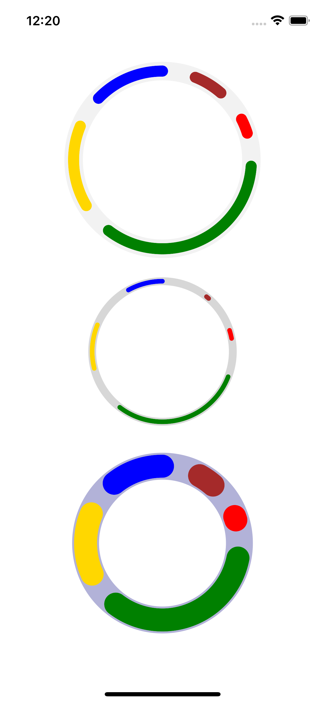

# React Native Donut Chart


This is a simple donut chart that accepts a data object like the following:
```js
[
  {
    value: 1,
    color: 'brown',
  },
  {
    value: 2,
    color: 'red',
  }, {
    value: 3,
    color: 'green',
  }, {
    value: 4,
    color: 'gold',
  }, {
    value: 5,
    color: 'blue',
  },
]
```

This was a fast and quick hack to check the feasibility, more options can and will become available and a lot of improvements can be made.

>Contributors are welcomed, please open an issue, explain what you want to do and after approved make your PR.

Here is a screenshot of the randomized sample data:


